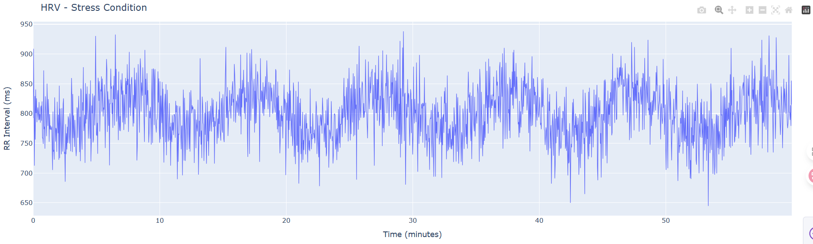
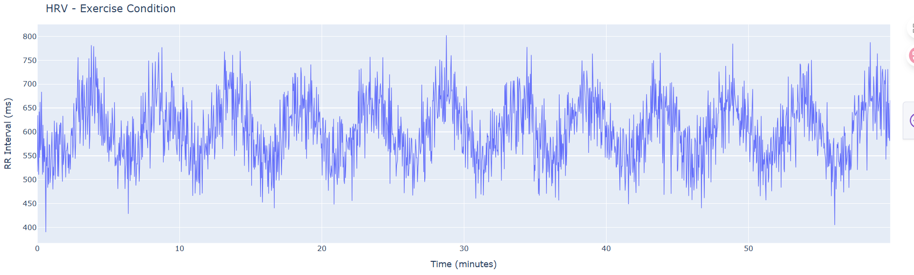
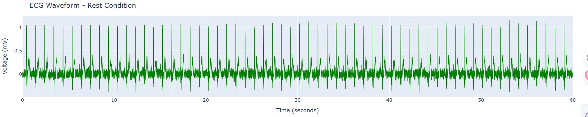
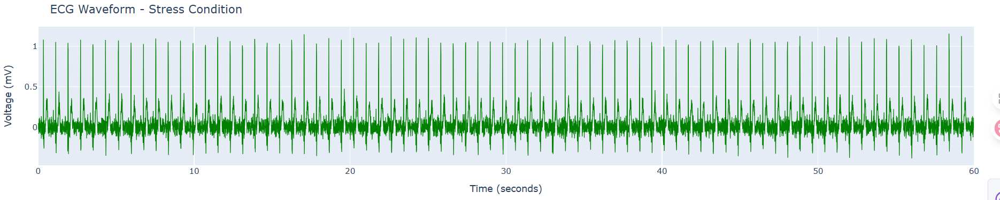
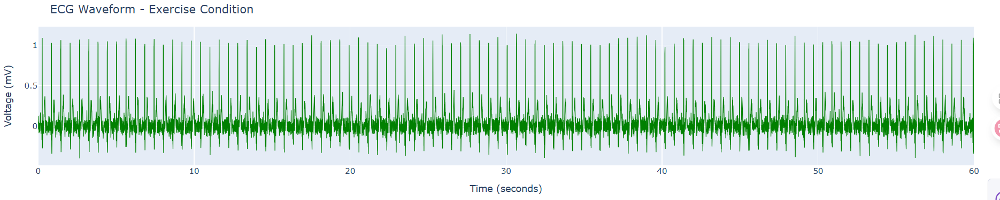
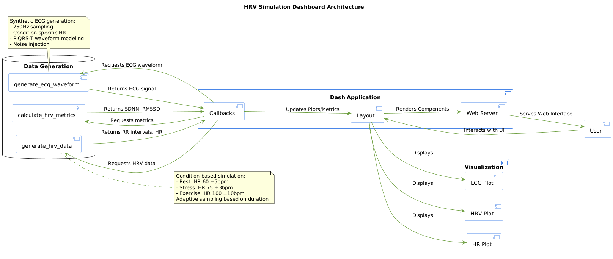
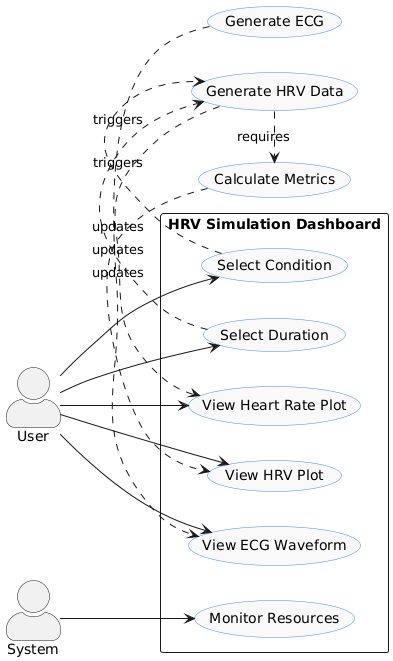

HRV Simulation Dashboard ❤️
========================

A comprehensive and interactive dashboard for simulating and visualizing Heart Rate Variability (HRV) and ECG data under different physiological conditions.

📋 Overview
-----------

The HRV Simulation Dashboard is a Python-based web application built with Dash that generates realistic synthetic heart rate variability data and ECG waveforms for three different physiological states: rest, stress, and exercise. The application provides real-time visualization of cardiac parameters and HRV metrics.

🚀 Features
-----------

**Multi-Condition Simulation:**
- 🧘 Rest: Low heart rate, high variability
- 😰 Stress: Medium heart rate, low variability
- 🏃 Exercise: High heart rate, medium variability

**Flexible Duration Settings:** Generate data from 1 minute to 24 hours

**Real-time Visualizations:**
- HRV (RR Intervals) plot
- Heart Rate trend plot
- Synthetic ECG waveform

**HRV Metrics Calculation:** SDNN, RMSSD, pNN50

**Memory Efficient:** Uses LRU caching and adaptive sampling

**Responsive Design:** Built with Bootstrap components

📊 Sample Visualizations
----------------------

**Dashboard Overview:**

**HRV Plots by Condition:**
- Rest Condition: 
- Stress Condition: 
- Exercise Condition: 

**ECG Waveforms by Condition:**
- Rest ECG: 
- Stress ECG: 
- Exercise ECG: 

🏗️ Architecture
---------------

- System Design: 
- User Interaction Flow: 

📈 HRV Metrics Explained
-----------------------

- **SDNN:** Standard deviation of NN intervals - reflects overall HRV
- **RMSSD:** Root mean square of successive differences - indicates parasympathetic activity
- **pNN50:** Percentage of successive RR intervals differing by >50ms - vagal tone indicator

🔬 Technical Details
------------------

**Data Generation:**
- Adaptive Sampling: Varies based on duration (1.0 Hz for ≤10min, 0.5 Hz for ≤60min, 0.1 Hz for >60min)
- Realistic Variability: Condition-specific parameters for physiological accuracy
- ECG Synthesis: Template-based approach with P, QRS, and T waves

**Performance Optimization:**
- LRU caching for data generation functions
- Memory usage monitoring
- Efficient downsampling for long durations

🏥 Applications
---------------

- Educational Tool: Understand HRV and ECG principles
- Research Prototyping: Test HRV analysis algorithms
- Clinical Simulation: Model different physiological states
- Device Testing: Validate HRV measurement approaches
